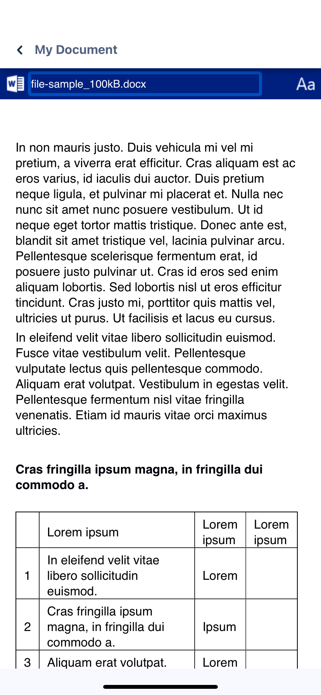

# @abdullahnasir/react-native-officeapps-wrapper

## Install

```sh
$ npm install @abdullahnasir/react-native-documents-viewer
```

or

```sh
$ yarn add @abdullahnasir/react-native-documents-viewer
```

## Link

```sh
$ react-native link react-native-webview
```

## Use

```js
...
import { DocumentViewer } from '@abdullahnasir/react-native-documents-viewer'
...
<DocumentViewer containerStyle={{ marginTop: 10 }} source="https://filesamples.com/samples/document/docx/sample4.docx" />
...
```

## Demo



## Thanks

- [Office Web Viewer: View Office documents in a browser](http://t.cn/EorILXa)
- [前端实现在线预览 pdf、word、xls、ppt 等文件](http://t.cn/Rg3RgaR)
- [android 你所不知道的 word,pdf 预览方案](http://t.cn/EorICdn)
- [android 使用 webview 预览 png,pdf,doc,xls,txt，等文件](http://t.cn/EorITHh)
